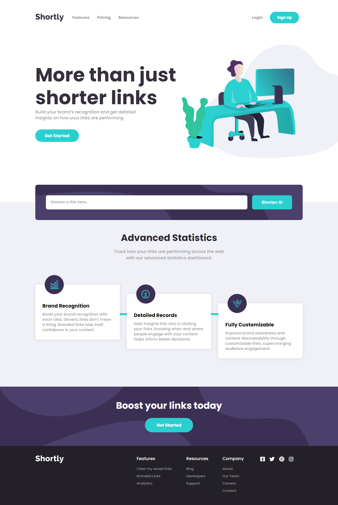
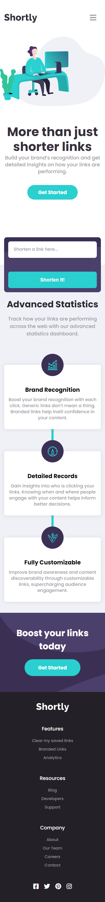
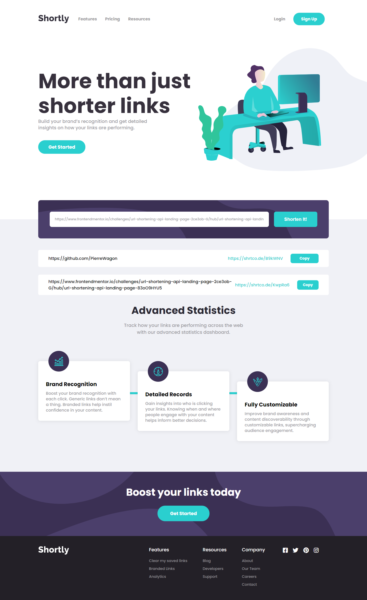
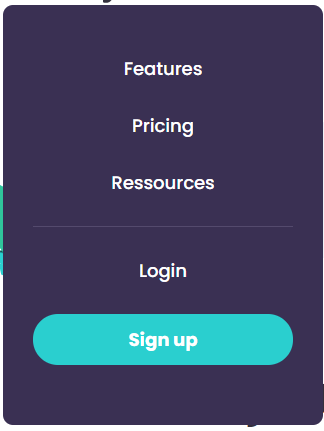
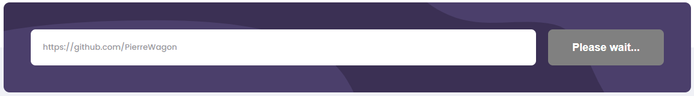

# Frontend Mentor - Shortly URL shortening API Challenge
  

### The challenge

Users should be able to:

- View the optimal layout for the site depending on their device's screen size
- See hover states for all interactive elements on the page
- Filter job listings based on the categories

### Screenshot

Computer view

Mobile view

Short urls appearing

Mobile Menu

Wait until the API finishes its work

### Built with

- HTML5
- CSS
- Javascript
- Flexbox

### What I learned

It was hard but I learned plenty of things, like dynamically creating some parts of pages, or how to store data on a computer.

### Features

- Shortens links, when user clicks on the shorten button it greys out and asks him to wait.

- Displays with a little animation the newly created link.

- Creates a new div each time a short link is created.

- Allows the user to copy the link to his clipboard by clicking the "Copy!" button. When clicked, it informs the user the link has been copied.

- Locally stores all the links created by the user.

- I added a feature on the footer, the first link is now called "Clear my saved links", and it clears local storage.